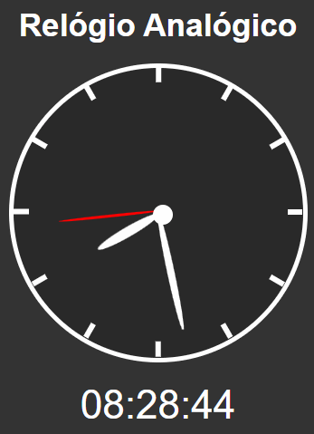
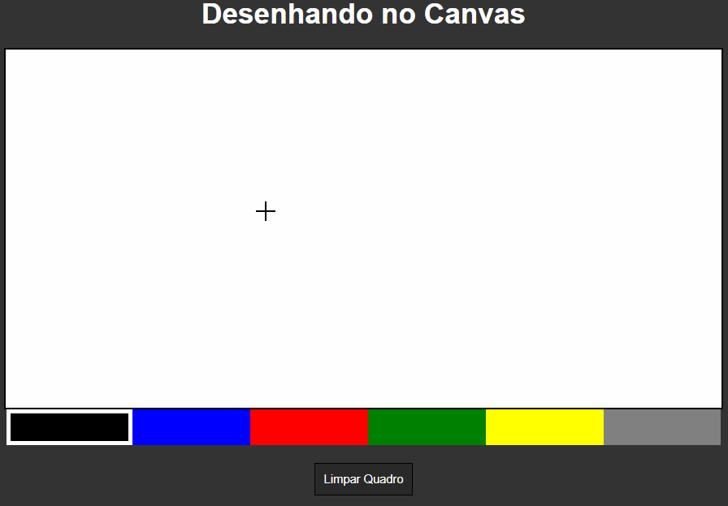

<h1 align="center">
    <br>
        
    <br>
</h1>

<div align="center">


<p align="center"> Visualize o projeto:
    Bateria: https://bateria-vanilla-js.netlify.app/
</p>
</div>

---
<div align="center">

<p align="center">
    Relógio Analógico: https://relogio-analogico-vanilla-js.netlify.app/
</p>
</div>

---
<div align="center">

<p align="center">
    Clima: https://clima-vanilla-js.netlify.app/
</p>
</div>

---
<div align="center">

<p align="center">
    Jogo da velha: https://jogo-da-velha-vanilla-js.netlify.app/
</p>
</div>

---
<div align="center">

<p align="center">
    Desenhando no canvas: https://desenhando-no-canvas-vanilla-js.netlify.app/
</p>
</div>

---
<div align="center">

<p align="center">
    Quiz: https://quiz-vanilla-js.netlify.app/
</p>
</div>

---
<div align="center">

<p align="center">
    Arrastar e Soltar: https://arrastar-e-soltar-vanilla-js.netlify.app/
</p>
</div>

&nbsp;&nbsp;

<br>
<br>

## ⚡ Tecnologias

&nbsp;
&nbsp;
&nbsp;

## ℹ️ Como Usar


#### ⚙️ Requisitos - (Opcional)

<p align="left">

[Baixar -> Live Server](https://marketplace.visualstudio.com/items?itemName=ritwickdey.LiveServer)
</p>

#### Iniciando o Desenvolvimento

```sh
# 1º Opção
Basta apenas inicializar com o Live Server

# 2º Opção
Arrastar e jogar o arquivo 'index.html' em uma aba no navegador
```

<p align="right"><kbd><b>
    <a href="#top">VOLTE PARA O TOPO 🔝</a>
</b></kbd></p> 
